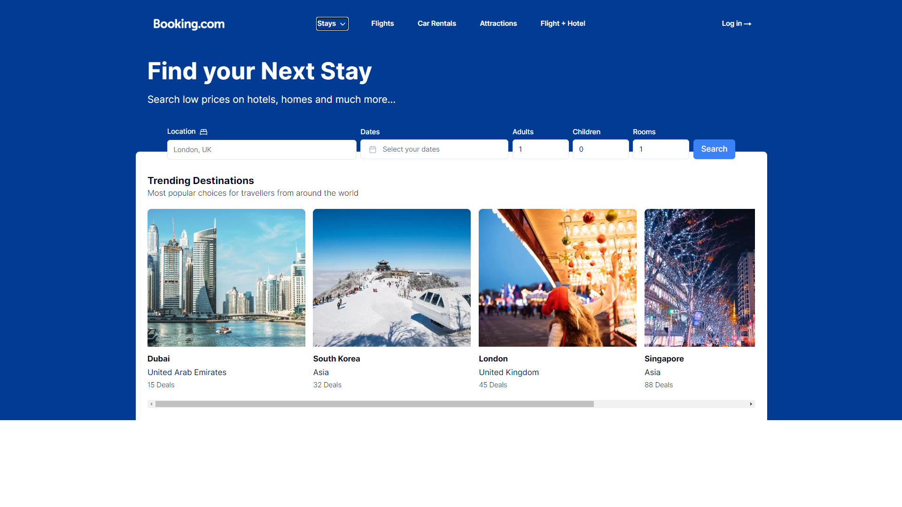
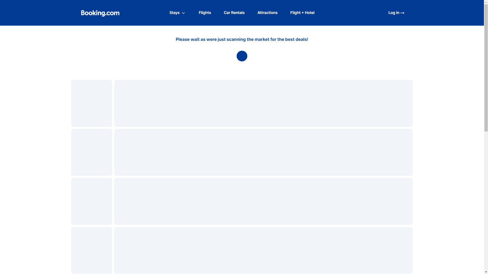
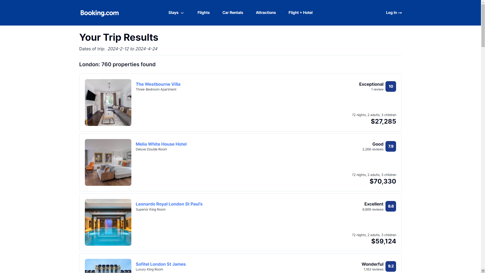
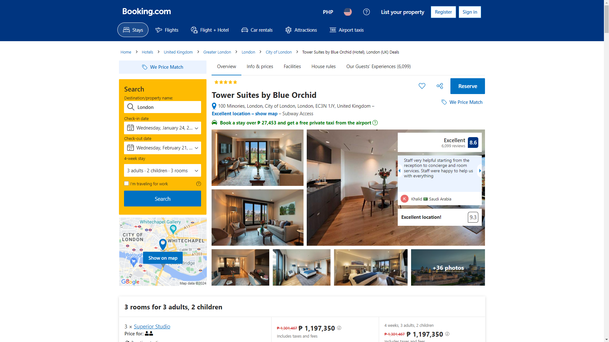

This is a simple booking website to book flights and hotels using oxylabs to scrape data from booking.com

## Screenshots






## Run the project

First, clone the repo and run the development server:

```bash
npm i
npm run dev

```

Open [http://localhost:3000](http://localhost:3000) with your browser to see the result.
